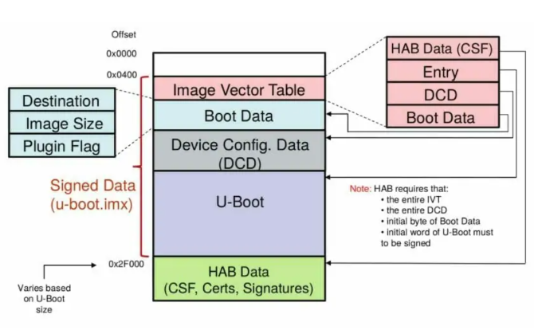
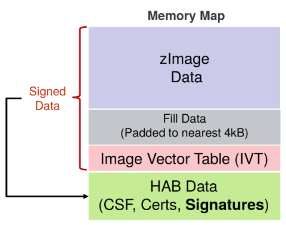
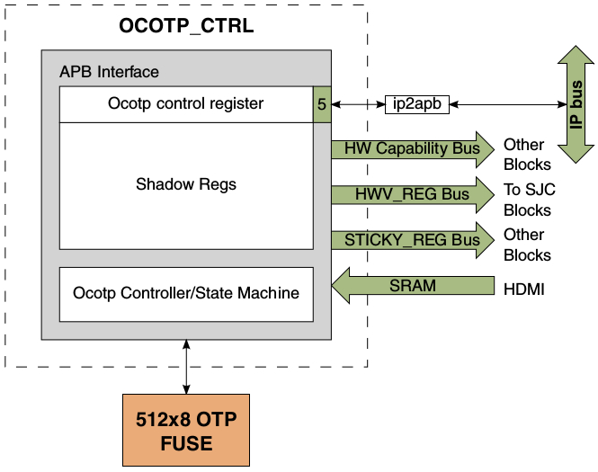

[TOC]

# U-boot with HAB build procedure

#### Environment setup

1. Download the required source code using the ***git*** utility.

```
$ git clone https://github.com/boundarydevices/u-boot-imx6 -b boundary-v2016.03
$ cd u-boot-imx6
```

2. Initialize the ***U-boot*** building environment.

```
$ export ARCH=arm
$ export CROSS_COMPILE=arm-linux-gnueabihf-
$ make nitrogen6q_defconfig
$ make menuconfig
```

3. Enable ***i.MX HAB features*** inside the configuration cli gui


#### Building procedure

4. Use ***make*** to start the build. Pipe the last 6 lines of output to a text file to take note of the load address, entry point, and HAB blocks.

```
$ make V=1 -j8 > build.log && cat build.log | tail -n 6 > hab_blocks.txt
$ cat hab_blocks.txt
```

    Image Type:   Freescale IMX Boot Image
    Image Ver:    2 (i.MX53/6/7 compatible)
    Data Size:    507904 Bytes = 496.00 kB = 0.48 MB
    Load Address: 177ff420
    Entry Point:  17800000
    HAB Blocks:   177ff400 00000000 00079c00

# Linux build procedure

#### Environment setup

1. Download source code using the ***repo*** utility.

```
$ sudo apt-get install repo
$ mkdir ~/imx6yocto && cd imx6yocto
$ repo init -u https://github.com/boundarydevices/boundary-bsp-platform -b gatesgarth
$ repo sync
```

2. Initialize the ***yocto*** build environment.

```
$ MACHINE=nitrogen6q DISTRO=boundary-xwayland . setup-environment build
```

3. Edit the ***build/conf/local.conf*** configuration file to your specific build needs.

```
$ vim conf/local.conf
```

```
MACHINE ??= 'nitrogen6x'
DISTRO ?= 'boundary-xwayland'
PACKAGE_CLASSES ?= "package_rpm"
EXTRA_IMAGE_FEATURES ?= "debug-tweaks"
USER_CLASSES ?= "buildstats image-mklibs image-prelink"
PATCHRESOLVE = "noop"
BB_DISKMON_DIRS ??= "\
    STOPTASKS,${TMPDIR},1G,100K \
    STOPTASKS,${DL_DIR},1G,100K \
    STOPTASKS,${SSTATE_DIR},1G,100K \
    STOPTASKS,/tmp,100M,100K \
    ABORT,${TMPDIR},100M,1K \
    ABORT,${DL_DIR},100M,1K \
    ABORT,${SSTATE_DIR},100M,1K \
    ABORT,/tmp,10M,1K"
PACKAGECONFIG_append_pn-qemu-system-native = " sdl"
CONF_VERSION = "1"

#LICENSE_FLAGS_WHITELIST = "commercial"

DL_DIR ?= "${BSPDIR}/downloads/"
SSTATE_DIR ?= "${BSPDIR}/sstate-cache/"
ACCEPT_FSL_EULA = "1"

BB_NO_NETWORK ?= '0'
CONNECTIVITY_CHECK_URIS = "https://www.google.com/"

PARALLEL_MAKE = "-j 8"
BB_NUMBER_THREADS = "24"
```

#### Building procedure

4. Use the ***bitbake*** command to start building the target image.

```
$ bitbake boundary-image-multimedia-full
```

```
Loading cache: 100% |#################################################################################| Time: 0:00:00
Loaded 3955 entries from dependency cache.
NOTE: Resolving any missing task queue dependencies

Build Configuration:
BB_VERSION           = "1.48.0"
BUILD_SYS            = "x86_64-linux"
NATIVELSBSTRING      = "universal"
TARGET_SYS           = "arm-fslc-linux-gnueabi"
MACHINE              = "nitrogen6x"
DISTRO               = "boundary-xwayland"
DISTRO_VERSION       = "3.2"
TUNE_FEATURES        = "arm vfp cortexa9 neon thumb callconvention-hard"
TARGET_FPU           = "hard"
meta
meta-poky            = "HEAD:6a751048e50c00261d99c2d8d69534f7a8da38a9"
meta-gnome
meta-multimedia
meta-networking
meta-oe
meta-python
meta-initramfs       = "HEAD:f3f7a5f1a4713f145107bb043e0d14cb3a51c62f"
meta-freescale       = "HEAD:d5a82541a97dd3a6b9116a1cd72f9965510a3de9"
meta-freescale-3rdparty = "HEAD:4297672fe35c2c24350f0eaba3d909f5a2dcee4c"
meta-freescale-distro = "HEAD:50eb2b32e7702bc435049bfe0a98fc65c864c106"
meta-freescale-ml    = "HEAD:3ca77e12b613c6f313b95d8e573873e15a04fa62"
meta-qt5             = "HEAD:aa96d3b978d63caeaaf5294b0171506c89cb7eba"
meta-boundary        = "HEAD:bca54ff0313adeb2d50722e2f9c17fdb6ebc5d10"

Initialising tasks: 100% |############################################################################| Time: 0:00:04
Sstate summary: Wanted 3 Found 0 Missed 3 Current 2737 (0% match, 99% complete)
NOTE: Executing Tasks
Currently  1 running tasks (6203 of 6828)  90% |#############################################################       				   |
0: boundary-image-multimedia-full-1.0-r0 do_rootfs (pid 4758)  13% |######              |
```

5. After the build completes the ***images*** will be within the ***deploy*** directory.

```
tmp/deploy/images/{MACHINE}/boundary-image-multimedia-full-{MACHINE}.wic.gz
```

#### Having issues building?

1. Remove the ***tmp*** and ***cache*** directories to clean out corrupted the files

```
$ sudo rm -rf cache tmp
```

2. Run the ***cleanall*** utility in ***bitbake***

```
$ bitbake boundary-image-multimedia-full -c cleanall
```

# Key Generation

1. Unpack the NXP ***code signing tools***.

```
$ mkdir CST && cd CST
$ tar xzf cst-3.1.0.tgz
$ mv -r release/* . && rmdir release
```

2. Create the ***key password*** and ***serial certificate*** ***numbers***.

```
$ vim key_pass.txt
	gimmeshelter
	gimmeshelter
$ vim serial
	42424242
```

#### Keys

3. Generate the the ***keys*** and ***certificates*** that will be used by the ***HAB engine***. Use the same options selected below after running the key generation script.

```
$ ./hab4_pki_tree.sh
```

```
+++++++++++++++++++++++++++++++++++++++++++++++++++++++++++++++
This script is a part of the Code signing tools for Freescale's
High Assurance Boot.  It generates a basic PKI tree.  The PKI
tree consists of one or more Super Root Keys (SRK), with each
SRK having two subordinate keys:
+ a Command Sequence File (CSF) key
+ Image key.
Additional keys can be added to the PKI tree but a separate
script is available for this.  This this script assumes openssl
is installed on your system and is included in your search
path.  Finally, the private keys generated are password
protectedwith the password provided by the file key_pass.txt.
The format of the file is the password repeated twice:
my_password
my_password
All private keys in the PKI tree are in PKCS #8 format will be
protected by the same password.
+++++++++++++++++++++++++++++++++++++++++++++++++++++++++++++++
Do you want to use an existing CA key (y/n)?: n
Do you want to use Elliptic Curve Cryptography (y/n)?: n
Enter key length in bits for PKI tree: 4096
Enter PKI tree duration (years): 10
How many Super Root Keys should be generated? 4
Do you want the SRK certificates to have the CA flag set? (y/n)?: y
```

#### Fuse values

4. Generate the ***fuse values*** to be flashed on the board later using the ***srktool*** (super root key creation tool) included in the NXP code signing package. ***Fuse values*** will sequentially be stored in ***fusevals.txt***.

```
$ cd ../crts
$ ../linux64/bin/srktool -h 4 -t SRK_1_2_3_4_table.bin -e SRK_1_2_3_4_fuse.bin -d sha256 -c ./SRK1_sha256_4096_65537_v3_ca_crt.pem, ./SRK2_sha256_4096_65537_v3_ca_crt.pem, ./SRK3_sha256_4096_65537_v3_ca_crt.pem, ./SRK4_sha256_4096_65537_v3_ca_crt.pem -f 1
$ hexdump -e '/4 "0x"' -e '/4 "%X""\n"' < SRK_1_2_3_4_fuse.bin > fusevals.txt
$ cat fusevals.txt
```

```
0x86EDFF95
0x0873CD5F
0x04C4270D
0xFB3E1D49
0xEC85FF01
0x88BCC7FF
0xCADC9314
0xF13833B3
```

# Signing U-boot and Linux

### Signing U-boot



1. Copy over u-boot.imx to the CST directory.

```
$ cd ~/CST/linux64/bin
$ cp ~/u-boot-imx6/u-boot.imx .
```

#### Create the CSF

2. Create a ***.csf*** file that will instruct the CST tool how to sign the u-boot image. Be sure to ***edit the blocks line*** to match the data in the ***hab_blocks.txt*** file created earlier.

```
$ vim u-boot.csf
```

```
[Header]
Version = 4.1
Security Configuration = Open
Hash Algorithm = sha256
Engine Configuration = 0
Certificate Format = X509
Signature Format = CMS
Engine = CAAM

[Install SRK]
File = "../../crts/SRK_1_2_3_4_table.bin"
Source index = 0

[Install CSFK]
File = "../../crts/CSF1_1_sha256_4096_65537_v3_usr_crt.pem"

[Authenticate CSF]

[Install Key]
# Key slot index used to authenticate the key to be installed
Verification index = 0
# Key to install
Target index = 2
File = "../../crts/IMG1_1_sha256_4096_65537_v3_usr_crt.pem"

[Authenticate Data]
Verification index = 2
Blocks = 0x177ff400 0x0 0x79c00 "u-boot.imx"
```

3. Use the ***CST tool*** to create ***HAB data*** and then create the ***signed u-boot image.***

```
$ ./cst --o u-boot_csf.bin --i u-boot.csf
CSF Processed successfully and signed data available in u-boot_csf.bin
$ cat u-boot.imx u-boot_csf.bin > u-boot_signed.imx
$ cp u-boot_signed.imx u-boot.nitrogen6q
```

### Signing the linux kernel



1. Copy over ***zImage*** to the CST directory

```
$ cd ~/CST/linux64/bin
$ cp ~/imx6yocto/build/tmp/deploy/images/nitrogen6x/zImage .
```

#### Padding the zImage

2. Determine the size of the ***zImage*** binary to be signed. Make note of its size and round to the nearest ***4kB boundary***. For example, 0x68e570 will round to ***0x68f000***

```
$ hexdump zImage | tail -n 1
```


```
068e570
```

3. Pad ***zImage*** to the nearest ***4kB boundary***.

```
$ objcopy -I binary -O binary --pad-to=0x68f000 --gap-fill=0x00 zImage zImage-pad.bin
```

#### Create the IVT

4. Create a script that will generate an ***IVT*** to be appended to the ***zImage***.

| NAME          | CALCULATION                                        | VALUE      |
| ------------- | :------------------------------------------------- | :--------- |
| Jump location | load address + 0x1000                              | 0x10801000 |
| DCD pointer   | must be 0                                          | 0x0        |
| Boot data     | must be 0                                          | 0x0        |
| Self pointer  | load address + size of zImage padded               | 0x10e8f000 |
| CSF pointer   | load address + size of zImage padded + size of IVT | 0x10e8f020 |

```
$ vim genIVT
```

```
#! /usr/bin/perl -w
use strict;
open(my $out, '>:raw', 'ivt.bin') or die "Unable to open: $!";
print $out pack("V", 0x412000D1); # IVT Header
print $out pack("V", 0x10801000); # Jump Location
print $out pack("V", 0x0); # Reserved
print $out pack("V", 0x0); # DCD pointer
print $out pack("V", 0x0); # Boot Data
print $out pack("V", 0x10e8f000); # Self Pointer
print $out pack("V", 0x10e8f020); # CSF Pointer
print $out pack("V", 0x0); # Reserved
close($out);
```

```
$ ./genIVT && hexdump ivt.bin
```

```
0000000 00d1 4120 1000 1080 0000 0000 0000 0000
0000010 0000 0000 f000 10e8 f020 10e8 0000 0000
0000020
```

5. Append the ***IVT*** file to the end of the padded ***zImage***.

```
$ cat zImage-pad.bin ivt.bin > zImage-pad-ivt.bin
```

#### Create the CSF

6. Create a ***.csf*** file that will instruct the CST tool how to sign the linux ***zImage***. Be sure to ***edit the blocks line*** to the following format Blocks = <<load_address>> 0x0 <<size_zImage_padded + size_ivt>> before you execute the CST tool.

```
[Header]
Version = 4.0
Hash Algorithm = sha256
Engine Configuration = 0
Certificate Format = X509
Signature Format = CMS

[Install SRK]
File = "../../crts/SRK_1_2_3_4_table.bin"
Source index = 0

[Install CSFK]
File = "../../crts/CSF1_1_sha256_4096_65537_v3_usr_crt.pem"

[Authenticate CSF]

[Install Key]
Verification index = 0
Target index = 2
File = "../../crts/IMG1_1_sha256_4096_65537_v3_usr_crt.pem"

[Authenticate Data]
Verification index = 2
Blocks = 0x10800000 0x0 0x68f020 "zImage-pad-ivt.bin"
```

7. Execute the CST tool to create the HAB data. Next, append the image with the HAB data to create the final signed binary.

```
$ ./cst --o zImage_csf.bin --i zImage.csf
$ cat zImage-pad-ivt.bin zImage_csf.bin > zImage_signed
```

# Preparing installation media

#### Using Balena Etcher on Windows

1. Upload the ***boundary-image-multimedia-full-nitrogen6x.wic*** image created earlier from ***imx6yocto/build/tmp/deploy/images/nitrogen6x/*** to a windows host.
2. Import the image to a ***Balena Etcher*** and flash. This will create two partitions. The first partition contains an ***unsigned zImage*** and ***linux device trees***. The next partition contains the linux ***root file system***.


3. Next copy any neccessary u-boot upgrade scripts, u-boot boot scripts, u-boot images, device trees, and the signed zImage to the ***fat partition*** on the ***installation media***.

```
PS F:\> ls
    Directory: F:\
Mode                 LastWriteTime         Length Name
----                 -------------         ------ ----
-a----   Tue, 12, 31, 2097  11:00            4898 boot.scr
                                PM
-a----   Tue, 12, 31, 2097  11:00           48095 imx6dl-nitrogen6_vm-magstripe.dtb
                                PM
-a----   Tue, 12, 31, 2097  11:00           48075 imx6dl-nitrogen6_vm.dtb
                                PM
-a----   Tue, 12, 31, 2097  11:00           53740 imx6dl-nitrogen6x.dtb
                                PM
-a----   Tue, 12, 31, 2097  11:00           56695 imx6q-nitrogen6_max.dtb
                                PM
-a----   Tue, 12, 31, 2097  11:00           53413 imx6q-nitrogen6_som2.dtb
                                PM
-a----   Tue, 12, 31, 2097  11:00           54997 imx6q-nitrogen6x.dtb
                                PM
-a----   Tue, 12, 31, 2097  11:00           53283 imx6q-sabrelite.dtb
                                PM
-a----   Tue, 12, 31, 2097  11:00           58562 imx6qp-nitrogen6_max.dtb
                                PM
-a----   Tue, 12, 31, 2097  11:00           55276 imx6qp-nitrogen6_som2.dtb
                                PM
-a----   Tue, 12, 31, 2097  11:00         6874480 zImage
                                PM
-a----  Mon, 6, 28, 2021   3:54 PM           4909 6x_bootscript
-a----  Wed, 6, 30, 2021  10:01 AM           3659 6x_upgrade
-a----  Wed, 6, 30, 2021  12:12 PM        6883672 zImage_signed
-a----   Thu, 7, 1, 2021  11:33 AM           5803 upgrade.scr
-a----  Wed, 6, 30, 2021  11:32 AM         505152 u-boot.nitrogen6q
```


# Flashing U-boot

1. If u-boot isn't already installed see the manufacturers device recovery process.
2. Setup a terminal for ***8N1, 115200 baud***, plug in the installation media, and connect the board to the host via ***uart***.
3. Execute the ***upgradeu*** script. To update the u-boot to your hab configured u-boot.

```
=> run upgradeu
```

4. Execute the ***hab_status*** command to verify the the new installation is HAB configured.

```
=> hab_status

Secure boot disabled

HAB Configuration: 0xf0, HAB State: 0x66
No HAB Events Found!
```

# Flashing the keys... pseudo



1. Find the ***fusevals.txt*** file created earlier

```
$ cat fusevals.txt
```

```
0x86EDFF95
0x0873CD5F
0x04C4270D
0xFB3E1D49
0xEC85FF01
0x88BCC7FF
0xCADC9314
0xF13833B3
```

2. Use the fuse values to create a ***fuse_override*** script. The ***override*** option will only write to the shadow registers. The fuses themselves will ***NOT*** be burned.

```
=> setenv fuse0 3 0 0x86EDFF95
=> setenv fuse1 3 1 0x0873CD5F
=> setenv fuse2 3 2 0x04C4270D
=> setenv fuse3 3 3 0xFB3E1D49
=> setenv fuse4 3 4 0xEC85FF01
=> setenv fuse5 3 5 0x88BCC7FF
=> setenv fuse6 3 6 0xCADC9314
=> setenv fuse7 3 7 0xF13833B3
=> setenv fuse_override fuse override \${fuse0}";" fuse override \${fuse1}";" fuse override \${fuse2}";" fuse override \${fuse3}";" fuse override \${fuse4}";" fuse override \${fuse5}";" fuse override \${fuse6}";" fuse override \${fuse7}";" fuse override 0 6 0x2
=> savee
Saving Environment to SPI Flash...
SF: Detected SST25VF016B with page size 256 Bytes, erase size 4 KiB, total 2 MiB
Erasing SPI flash...Writing to SPI flash...done
```

3. Test the fuse_override script

```
=> run fuse_override
Overriding bank 3 word 0x00000000 with 0x86EDFF95...
Overriding bank 3 word 0x00000001 with 0x0873CD5F...
Overriding bank 3 word 0x00000002 with 0x04C4270D...
Overriding bank 3 word 0x00000003 with 0xFB3E1D49...
Overriding bank 3 word 0x00000004 with 0xEC85FF01...
Overriding bank 3 word 0x00000005 with 0x88BCC7FF...
Overriding bank 3 word 0x00000006 with 0xCADC9314...
Overriding bank 3 word 0x00000007 with 0xF13833B3...
Overriding bank 0 word 0x00000006 with 0x00000002...
=>
```

# Booting and Authenticating Linux

#### Prepare the u-boot environment for booting linux

1. Specify the type, device number, and partition number of the installation media's fat partition containing the device tree and zImage.

```
=> setenv dev_type usb
=> setenv dev 0
=> setenv dev_part 1
```

2. Specify the zImage and device tree load addresses. 

```
=> setenv a_zImage 0x10800000
=> setenv a_fdt 0x13000000
=> setenv ivt 0x0x68f000
=> setenv image zImage
=> setenv image_signed zImage_signed
=> setenv fdt imx6q-sabrelite.dtb
```

3. Create a HAB authentication script to verify the kernel. Specify the zImage address and the IVT offset.

```
=> setenv habtest hab_auth_img \${a_zImage} \${ivt}
```

4. Create an initialization script that loads the zImage and device tree. Be sure to maintain 4kB alignment. 

```
=> setenv bootinit usb start";" load \${dev_type} \${dev}:\${dev_part} \${a_zImage} \${image}";" load \${dev_type} \${dev}:\${dev_part} \${a_fdt} \${fdt}";" fdt addr \${a_fdt}";" fdt resize 4096
=> setenv bootinitsec setenv image \${image_signed}";" run bootinit";" run fuse_override";" run habtest
```

5. Set the default boot script and boot arguments

```
=> setenv bootcmd run bootinitsec";" bootz \${a_zImage} - \${a_fdt}
=> setenv bootargs console=ttymxc1,115200 vmalloc=400M consoleblank=0 rootwait fixrtc board=nitrogen6x root=/dev/sda2
=> savee
```

6. Power the device off and then back on again... SECURE BOOT :)

```
U-Boot 2016.03-20644-ga783499351-dirty (Jun 30 2021 - 09:48:29 -0400)

CPU:   Freescale i.MX6Q rev1.2 at 792 MHz
Reset cause: POR
Board: SABRE Lite
I2C:   ready
DRAM:  1 GiB
MMC:   FSL_SDHC: 0, FSL_SDHC: 1
SF: Detected SST25VF016B with page size 256 Bytes, erase size 4 KiB, total 2 MiB
Display: hdmi:1280x720M@60 (1280x720)
In:    serial
Out:   serial
Err:   serial
Net:   Micrel ksz9021 at 6
FEC [PRIME], usb_ether
Hit any key to stop autoboot:  0
starting USB...
USB0:   Port not available.
USB1:   USB EHCI 1.00
scanning bus 1 for devices... 3 USB Device(s) found
       scanning usb for storage devices... 1 Storage Device(s) found
       scanning usb for ethernet devices... 0 Ethernet Device(s) found
reading zImage_signed
6883672 bytes read in 344 ms (19.1 MiB/s)
reading imx6q-sabrelite.dtb
53283 bytes read in 37 ms (1.4 MiB/s)
Overriding bank 3 word 0x00000000 with 0xbc4f1d36...
Overriding bank 3 word 0x00000001 with 0x66d8b9f5...
Overriding bank 3 word 0x00000002 with 0x22d97708...
Overriding bank 3 word 0x00000003 with 0xc67a9561...
Overriding bank 3 word 0x00000004 with 0x6c061825...
Overriding bank 3 word 0x00000005 with 0x117c2efd...
Overriding bank 3 word 0x00000006 with 0x3dc7fac6...
Overriding bank 3 word 0x00000007 with 0x38b57add...
Overriding bank 0 word 0x00000006 with 0x00000002...

Authenticate image from DDR location 0x10800000...

Secure boot enabled

HAB Configuration: 0xf0, HAB State: 0x66
No HAB Events Found!

Kernel image @ 0x10800000 [ 0x000000 - 0x68e570 ]
## Flattened Device Tree blob at 13000000
   Booting using the fdt blob at 0x13000000
   reserving fdt memory region: addr=13000000 size=e000
   Using Device Tree in place at 13000000, end 13010fff

Starting kernel ...

...

nitrogen6x login: root
root@nitrogen6x:~#
```

